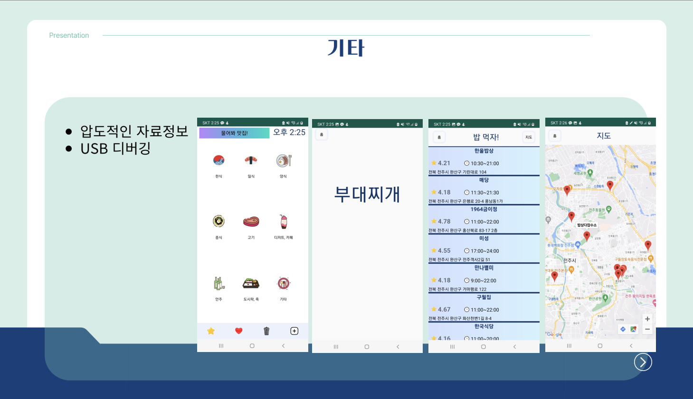

## Project Overview

This project is a restaurant recommendation application developed as part of a mobile programming class. We recommend customized restaurants based on the user's location and preferences and provide a platform for sharing reviews.

## Main features

1. **Location-based restaurant recommendation**: Restaurant recommendation based on current location using GPS
2. **Customized Filtering**: Filter restaurants based on food type, price range, rating, etc.
3. **Review System**: Ability to write user reviews and give ratings
4. **Social features**: Add friends and share restaurants

## Technology used

- **Programming language**: Kotlin
- **Development Environment**: Android Studio
- **Database**: SQLite
- **API**: Google Maps API

## Development process

1. Requirements analysis and planning
2. UI/UX design
3. Database design
4. Implement core functions
5. Testing and Debugging
6. Optimization and performance improvements

## Lessons learned and future plans

Through this project, I experienced the overall process of Android application development. In particular, we were able to improve our understanding of location-based services and database integration. In the future, we plan to improve features by reflecting user feedback and develop an iOS version as well.

## Screenshot

