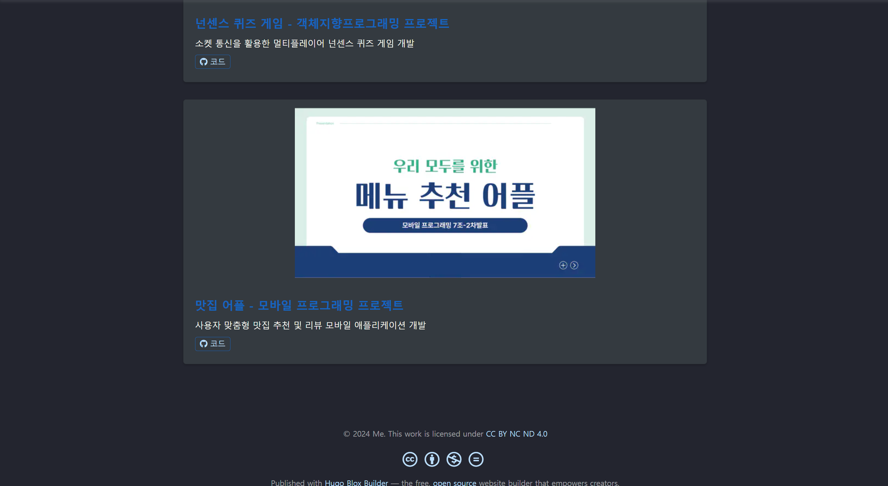

## Project Overview

This project is a comprehensive web service development project conducted as part of the web service design course. We built an operational web service by utilizing the entire web development stack, from front-end to back-end and database.

## Main components

1. **Assignment 1: Front-end development**
   - User interface implementation using React
   - Responsive web design applied

2. **Assignment 2: Backend Development**
   - Building a server using Node.js and Express.js
   - RESTful API design and implementation
   - Database integration (using ORM)

3. **Challenge 3: Deployment and Performance Optimization**
   - Distribution using github action
   - Apply web performance optimization techniques

## Technology used

- **Frontend**: React, Vue
- **Backend**: Node.js, Express.js, Flask
- **Database**: Mysql
- **API**: RESTful API
- **Distribution**: github action

## Development process

1. Requirements analysis and service planning
2. Data modeling and API design
3. Front-end UI/UX design and implementation
4. Building backend servers and databases
5. Frontend-backend integration
6. Testing and Debugging
7. Performance optimization and security enhancement
8. Distribution

## Lessons learned and future plans

This project allowed me to experience the entire process of modern web development. In particular, I gained a practical understanding of front-end and back-end interaction, database design, and deployment. Future plans include further developing the microservice architecture and adding security features to improve the user experience.

## Screenshot

