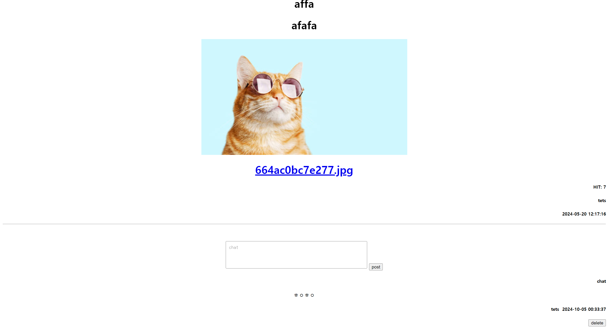

## Project Overview

This project is a security-enhanced bulletin board system development project conducted in the web service design course. The goal was to implement basic bulletin board functions using the APM (Apache, PHP, MySQL) stack, and based on this, analyze various security vulnerabilities and apply secure coding techniques to build a secure web service.

## Main components

1. **Implementation of basic bulletin board functions**
   - User registration and authentication system
   - Ability to create, edit, and delete posts
   - Comment system
   - File upload and download functions

2. **Security vulnerability analysis**
   - Check for SQL injection vulnerabilities
   - XSS (Cross-Site Scripting) vulnerability analysis
   - CSRF (Cross-Site Request Forgery) vulnerability scan
   - Check security issues related to file upload
   - Analysis of vulnerabilities related to session management and authentication

3. **Apply secure coding**
   - Implementation of input value verification and filtering
   - Prevent SQL injection using Prepared Statements
   - Output escaping to prevent XSS
   - CSRF token implementation
   - Secure file upload processing
   - Encrypted session management and secure authentication implementation
   - Enhanced account verification

4. **Enhanced performance and security**
   - Apache server security settings
   - Optimize PHP security settings
   - Enhanced MySQL database security

## Technology used

- **Web Server**: Apache
- **Server Side Script**: PHP
- **Database**: MySQL
- **Frontend**: HTML5, CSS3, JavaScript
- **Deployment Management**: Docker

## Development process

1. Building and setting up the APM environment
2. Implementation of basic bulletin board functions
3. Security vulnerability analysis and test case creation
4. Apply secure coding to discovered vulnerabilities
5. Optimize performance and implement additional security features
6. Full system security audit and vulnerability re-examination
7. Create documentation and user guides

## Lessons learned and future plans

This project gave me a deep understanding of how important security is for web applications. In particular, I learned a lot through discovering and resolving security vulnerabilities that are often overlooked in general web development. In the future, we plan to develop automated security testing tools and integrate security checks into continuous integration/deployment (CI/CD) pipelines.

## Screenshot

