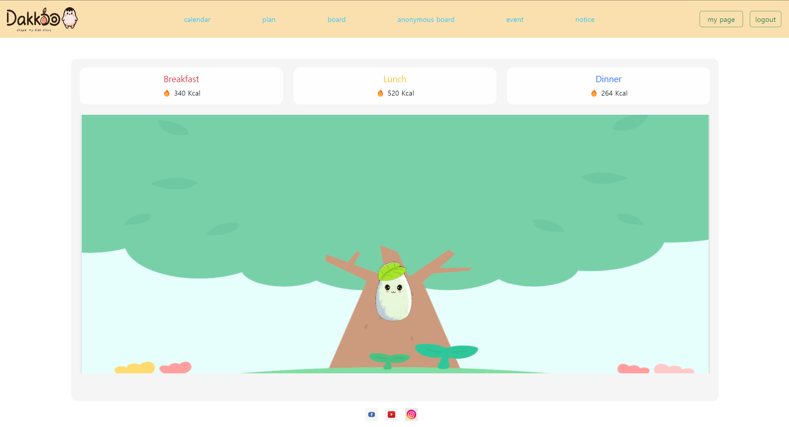
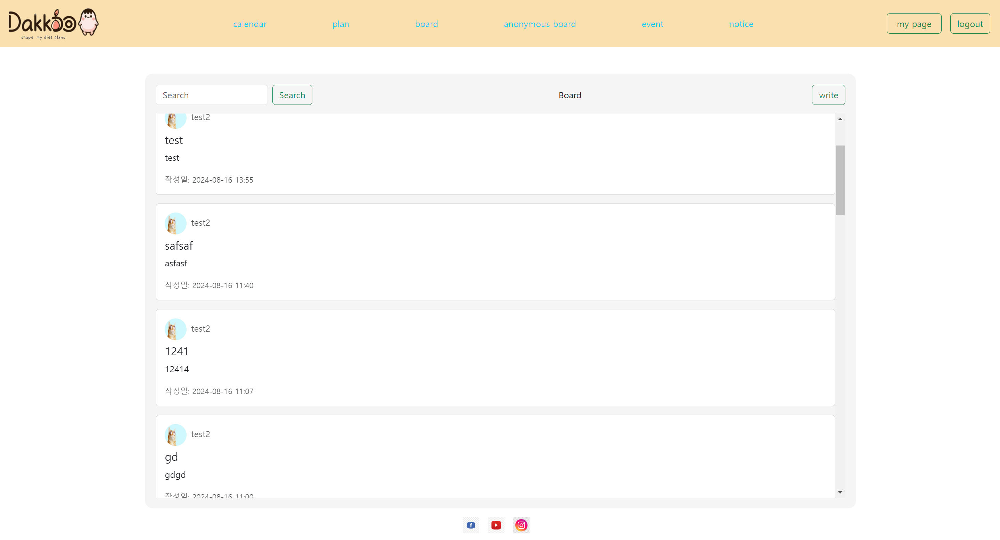
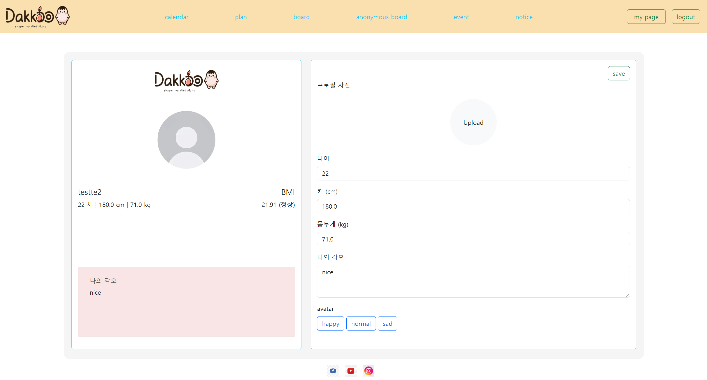

## Project Overview

This project is a personalized nutritional management and meal recommendation web application based on Flask, Python, and MySQL. Using public APIs, we implemented functions that provide food nutrition information, record and analyze users' diets, and recommend personalized diets.

## Main features

1. **Calendar-based diet tracking**
   - Enter and view daily, weekly, and monthly menu items
   - Automatically calculates nutritional content of consumed food

2. **Nutritional analysis and visualization**
   - Provides daily nutritional intake graph
   - Provides analysis results compared to recommended intake

3. **Customized diet recommendation**
   - Diet recommendations that take into account the user’s physical information, activity level, and goals
   - Personalized recommendations that reflect allergies and preferences

4. **Public API integration**
   - Utilization of food nutritional ingredient API
   - Real-time nutritional information updates

5. **Community Features**
   - Notices and bulletin boards/anonymous bulletin boards
   - Share meals and exchange tips between users

6. **Personalized User Profile**
   - My page function
   - User avatar settings and customization

## Technology used

- **Backend**: Flask (Python)
- **Database**: MySQL
- **Frontend**: HTML, CSS, JavaScript
- **API communication**: Requests library
- **Distribution**: Docker

## Development process

1. Requirements analysis and database design
2. Flask application structure setup
3. Public API integration and data processing logic implementation
4. Development of calendar-based UI and diet input function
5. Implementation of nutritional analysis algorithm and visualization
6. Development of a diet recommendation system
7. Implement user authentication and profile management functions
8. Add community function
9. Testing and Performance Optimization
10. Dockerizing and deployment

## Lessons learned and future plans

Through this project, I was able to experience the entire process of web application development using Flask. In particular, I learned in-depth about the use of public APIs, complex data processing, and UI/UX design that takes user experience into consideration. In the future, we plan to develop a more sophisticated diet recommendation algorithm using machine learning and release a mobile app version.

## Screenshot

