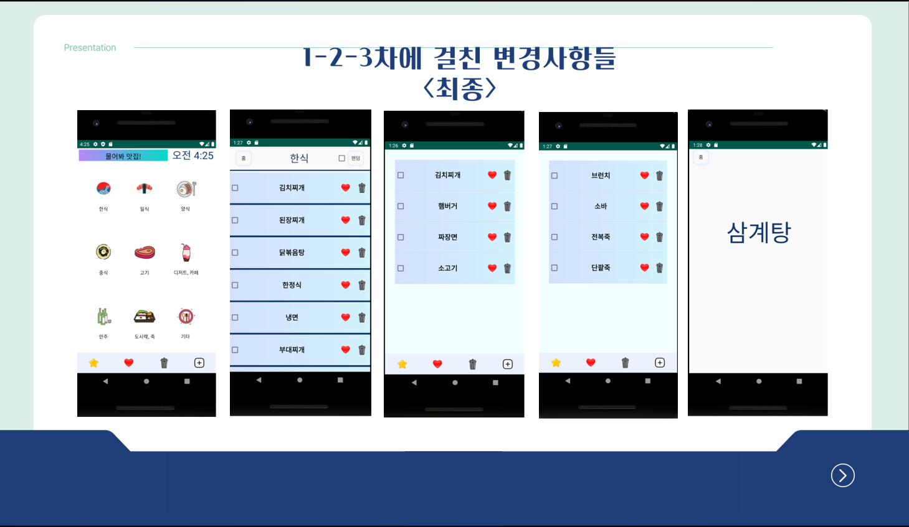

## 프로젝트 개요

본 프로젝트는 모바일 프로그래밍 수업의 일환으로 개발된 맛집 추천 애플리케이션입니다. 사용자의 위치와 선호도를 바탕으로 맞춤형 맛집을 추천하고, 리뷰를 공유할 수 있는 플랫폼을 제공합니다.

## 주요 기능

1. **위치 기반 맛집 추천**: GPS를 활용한 현재 위치 기반 맛집 추천
2. **맞춤형 필터링**: 음식 종류, 가격대, 평점 등을 기준으로 맛집 필터링
3. **리뷰 시스템**: 사용자 리뷰 작성 및 평점 부여 기능
4. **소셜 기능**: 친구 추가 및 맛집 공유 기능

## 사용 기술

- **프로그래밍 언어**: Kotlin
- **개발 환경**: Android Studio
- **데이터베이스**: SQLite
- **API**: Google Maps API

## 개발 과정

1. 요구사항 분석 및 기획
2. UI/UX 디자인
3. 데이터베이스 설계
4. 핵심 기능 구현
5. 테스트 및 디버깅
6. 최적화 및 성능 개선

## 배운 점 및 향후 계획

이 프로젝트를 통해 안드로이드 애플리케이션 개발의 전반적인 과정을 경험했습니다. 특히 위치 기반 서비스와 데이터베이스 연동에 대한 이해도를 높일 수 있었습니다. 향후 사용자 피드백을 반영하여 기능을 개선하고, iOS 버전도 개발할 계획입니다.

## 스크린샷

