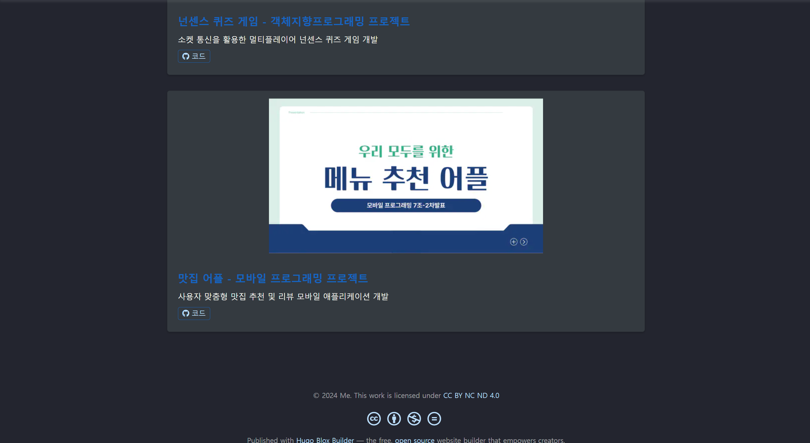

## 프로젝트 개요

본 프로젝트는 웹 서비스 설계 과목의 일환으로 진행된 종합 웹 서비스 개발 프로젝트입니다. 프론트엔드부터 백엔드, 데이터베이스까지 전반적인 웹 개발 스택을 활용하여 실제 운영 가능한 웹 서비스를 구축했습니다.

## 주요 구성 요소

1. **과제 1: 프론트엔드 개발**
   - React를 이용한 사용자 인터페이스 구현
   - 반응형 웹 디자인 적용

2. **과제 2: 백엔드 개발**
   - Node.js와 Express.js를 이용한 서버 구축
   - RESTful API 설계 및 구현
   - 데이터베이스 연동 (orm 사용)

3. **과제 3: 배포 및 성능 최적화**
   - github action 을 활용한 배포
   - 웹 성능 최적화 기법 적용

## 사용 기술

- **프론트엔드**: React, Vue
- **백엔드**: Node.js, Express.js, Flask
- **데이터베이스**: Mysql
- **API**: RESTful API
- **배포**: github action

## 개발 과정

1. 요구사항 분석 및 서비스 기획
2. 데이터 모델링 및 API 설계
3. 프론트엔드 UI/UX 설계 및 구현
4. 백엔드 서버 및 데이터베이스 구축
5. 프론트엔드-백엔드 통합
6. 테스트 및 디버깅
7. 성능 최적화 및 보안 강화
8. 배포

## 배운 점 및 향후 계획

이 프로젝트를 통해 현대적인 웹 개발의 전체 과정을 경험할 수 있었습니다. 특히 프론트엔드와 백엔드의 상호작용, 데이터베이스 설계, 그리고 배포에 대한 실질적인 이해를 얻었습니다. 향후 계획으로는 마이크로서비스 아키텍처를 더욱 발전시키고, 보안 기능을 추가하여 사용자 경험을 개선할 예정입니다.

## 스크린샷

