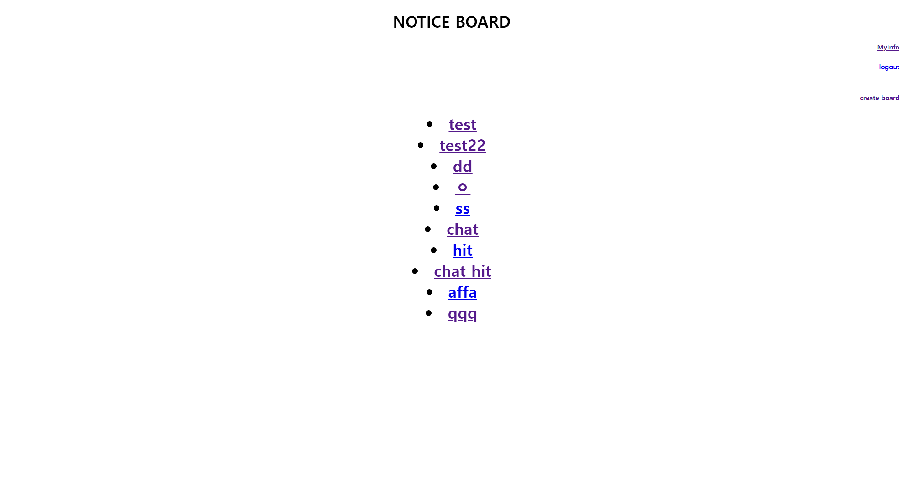
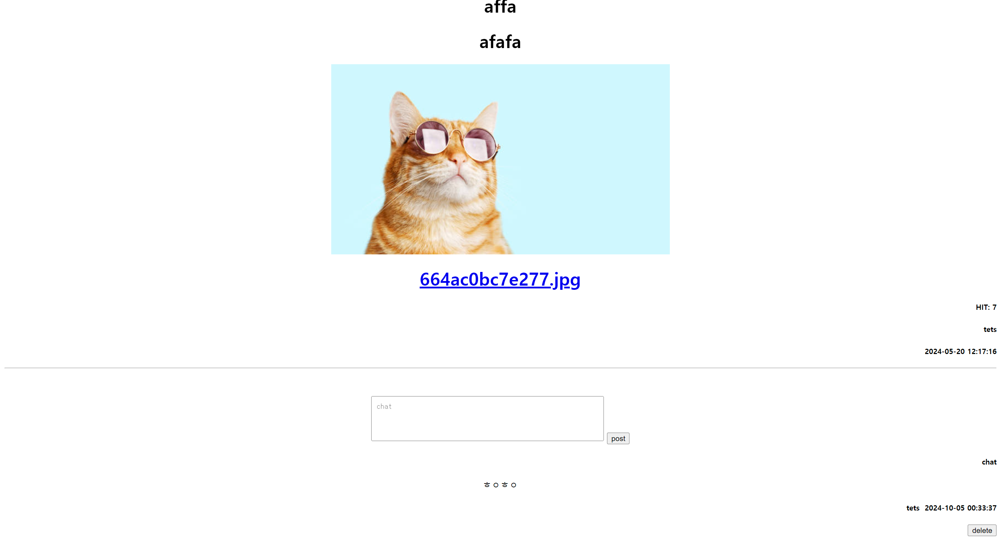

## 프로젝트 개요

본 프로젝트는 웹 서비스 설계 과목에서 진행한 보안 강화 게시판 시스템 개발 프로젝트입니다. APM(Apache, PHP, MySQL) 스택을 사용하여 기본적인 게시판 기능을 구현하고, 이를 바탕으로 다양한 보안 취약점을 분석하고 시큐어 코딩 기법을 적용하여 안전한 웹 서비스를 구축하는 것을 목표로 했습니다.

## 주요 구성 요소

1. **게시판 기본 기능 구현**
   - 사용자 등록 및 인증 시스템
   - 게시글 작성, 수정, 삭제 기능
   - 댓글 시스템
   - 파일 업로드, 다운로드 기능

2. **보안 취약점 분석**
   - SQL 인젝션 취약점 점검
   - XSS(Cross-Site Scripting) 취약점 분석
   - CSRF(Cross-Site Request Forgery) 취약점 검사
   - 파일 업로드 관련 보안 이슈 점검
   - 세션 관리 및 인증 관련 취약점 분석

3. **시큐어 코딩 적용**
   - 입력값 검증 및 필터링 구현
   - Prepared Statements를 이용한 SQL 인젝션 방지
   - XSS 방지를 위한 출력 이스케이핑
   - CSRF 토큰 구현
   - 안전한 파일 업로드 처리
   - 암호화된 세션 관리 및 안전한 인증 구현
   - 계정 검증 강화

4. **성능 및 보안 강화**
   - Apache 서버 보안 설정
   - PHP 보안 설정 최적화
   - MySQL 데이터베이스 보안 강화

## 사용 기술

- **웹 서버**: Apache
- **서버 사이드 스크립트**: PHP
- **데이터베이스**: MySQL
- **프론트엔드**: HTML5, CSS3, JavaScript
- **배포 관리**: Docker

## 개발 과정

1. APM 환경 구축 및 설정
2. 기본 게시판 기능 구현
3. 보안 취약점 분석 및 테스트 케이스 작성
4. 발견된 취약점에 대한 시큐어 코딩 적용
5. 성능 최적화 및 추가 보안 기능 구현
6. 전체 시스템 보안 감사 및 취약점 재점검
7. 문서화 및 사용자 가이드 작성

## 배운 점 및 향후 계획

이 프로젝트를 통해 웹 애플리케이션의 보안이 얼마나 중요한지 깊이 이해할 수 있었습니다. 특히 일반적인 웹 개발에서 흔히 간과될 수 있는 보안 취약점들을 직접 발견하고 해결하는 과정에서 많은 것을 배웠습니다. 향후에는 자동화된 보안 테스트 도구를 개발하고, 지속적인 통합/배포(CI/CD) 파이프라인에 보안 검사를 통합할 계획입니다.

## 스크린샷

