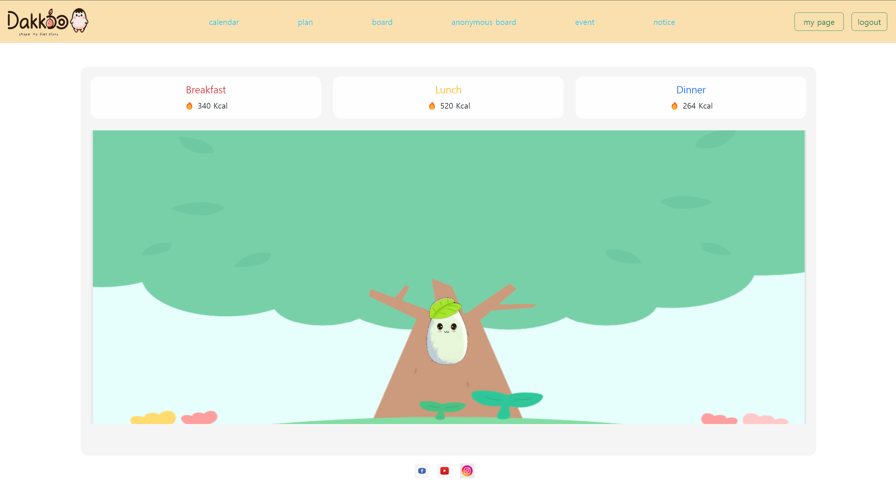
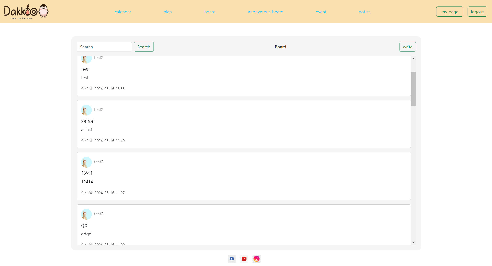
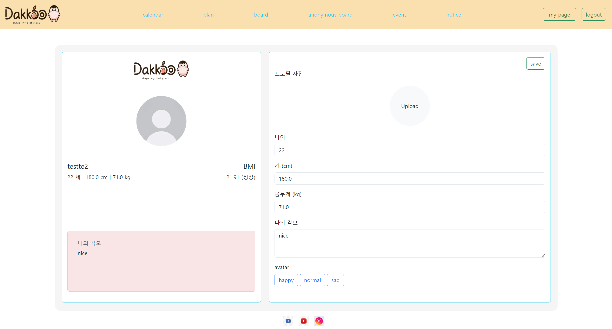

## 프로젝트 개요

본 프로젝트는 Flask, Python, MySQL을 기반으로 한 개인화된 영양 관리 및 식단 추천 웹 애플리케이션입니다. 공공 API를 활용하여 식품 영양 정보를 제공하고, 사용자의 식단을 기록하고 분석하며, 개인별 맞춤 식단을 추천하는 기능을 구현했습니다.

## 주요 기능

1. **달력 기반 식단 기록**
   - 일별, 주별, 월별 식단 입력 및 조회
   - 섭취한 음식의 영양 성분 자동 계산

2. **영양 성분 분석 및 시각화**
   - 일일 영양 섭취량 그래프 제공
   - 권장 섭취량 대비 분석 결과 제공

3. **맞춤형 식단 추천**
   - 사용자의 신체 정보, 활동량, 목표를 고려한 식단 추천
   - 알레르기, 선호도를 반영한 개인화 추천

4. **공공 API 연동**
   - 식품 영양성분 API 활용
   - 실시간 영양 정보 업데이트

5. **커뮤니티 기능**
   - 공지사항 및 게시판/익명게시판
   - 사용자 간 식단 공유 및 팁 교환

6. **개인화된 사용자 프로필**
   - 마이페이지 기능
   - 사용자 아바타 설정 및 커스터마이징

## 사용 기술

- **백엔드**: Flask (Python)
- **데이터베이스**: MySQL
- **프론트엔드**: HTML, CSS, JavaScript
- **API 통신**: Requests 라이브러리
- **배포**: Docker

## 개발 과정

1. 요구사항 분석 및 데이터베이스 설계
2. Flask 애플리케이션 구조 설정
3. 공공 API 연동 및 데이터 처리 로직 구현
4. 달력 기반 UI 및 식단 입력 기능 개발
5. 영양 분석 알고리즘 및 시각화 구현
6. 식단 추천 시스템 개발
7. 사용자 인증 및 프로필 관리 기능 구현
8. 커뮤니티 기능 추가
9. 테스트 및 성능 최적화
10. 도커라이징 및 배포

## 배운 점 및 향후 계획

이 프로젝트를 통해 Flask를 이용한 웹 애플리케이션 개발의 전체 과정을 경험할 수 있었습니다. 특히 공공 API의 활용, 복잡한 데이터 처리, 그리고 사용자 경험을 고려한 UI/UX 설계에 대해 깊이 있게 학습했습니다. 향후에는 머신러닝을 활용한 더 정교한 식단 추천 알고리즘을 개발하고, 모바일 앱 버전을 출시할 계획입니다.

## 스크린샷

